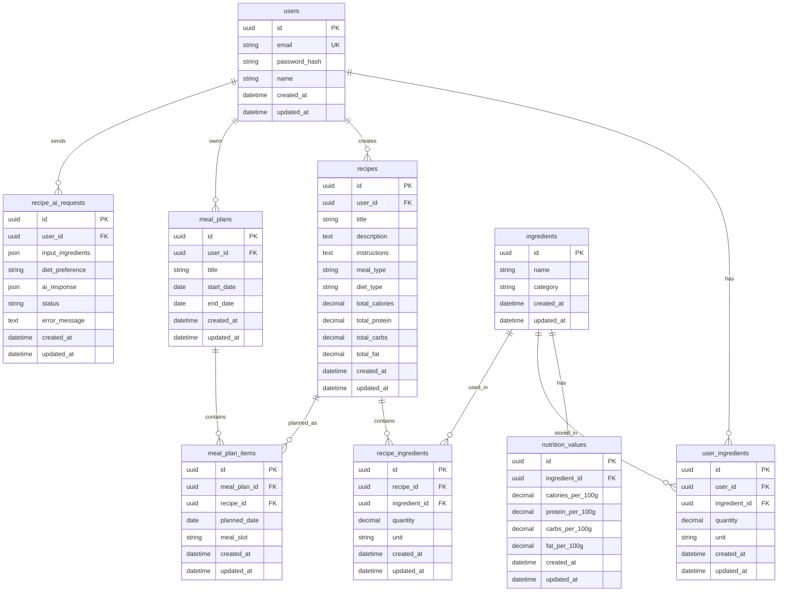

# Mealio Database Schema

This document describes the initial database schema for the Mealio application.

Mealio is a mobile application that allows users to manage available ingredients, generate recipes using AI, calculate nutritional values, and create meal plans.

---

## Main Tables

The first version of the database contains the following tables:

```txt
users
ingredients
nutrition_values
user_ingredients
recipes
recipe_ingredients
meal_plans
meal_plan_items
recipe_ai_requests
```

---

## Entity Relationship Diagram



---

## Table Descriptions

---

## 1. users

The `users` table stores registered application users.

Each user can have their own pantry, generated recipes, meal plans, and AI generation history.

### Fields

| Field | Type | Description |
|---|---|---|
| id | UUID | Primary key |
| email | String | Unique user email |
| password_hash | String | Hashed password |
| name | String | User display name |
| created_at | DateTime | Record creation date |
| updated_at | DateTime | Last update date |

### Constraints

| Constraint | Description |
|---|---|
| Primary Key | `id` |
| Unique | `email` |

### Relationships

- One user can have many pantry ingredients.
- One user can create many recipes.
- One user can have many meal plans.
- One user can send many AI recipe generation requests.

---

## 2. ingredients

The `ingredients` table stores base ingredients available in the system.

Examples:

```txt
chicken breast
rice
eggs
milk
oats
banana
tomato
potato
cheese
olive oil
```

### Fields

| Field | Type | Description |
|---|---|---|
| id | UUID | Primary key |
| name | String | Ingredient name |
| category | String | Ingredient category |
| created_at | DateTime | Record creation date |
| updated_at | DateTime | Last update date |

### Constraints

| Constraint | Description |
|---|---|
| Primary Key | `id` |
| Recommended Unique | `name` |

### Example Categories

```txt
meat
vegetables
fruits
dairy
grains
spices
oils
drinks
other
```

---

## 3. nutrition_values

The `nutrition_values` table stores nutritional values for each ingredient per 100 grams.

This separation keeps ingredient information clean and allows nutrition data to be updated independently.

### Fields

| Field | Type | Description |
|---|---|---|
| id | UUID | Primary key |
| ingredient_id | UUID | Foreign key to `ingredients.id` |
| calories_per_100g | Decimal | Calories per 100 grams |
| protein_per_100g | Decimal | Protein per 100 grams |
| carbs_per_100g | Decimal | Carbohydrates per 100 grams |
| fat_per_100g | Decimal | Fat per 100 grams |
| created_at | DateTime | Record creation date |
| updated_at | DateTime | Last update date |

### Constraints

| Constraint | Description |
|---|---|
| Primary Key | `id` |
| Foreign Key | `ingredient_id` references `ingredients.id` |
| Unique | `ingredient_id` |

### Relationship

- One ingredient has one nutrition value record.

---

## 4. user_ingredients

The `user_ingredients` table stores ingredients that a specific user currently has at home.

This table represents the user's pantry.

### Fields

| Field | Type | Description |
|---|---|---|
| id | UUID | Primary key |
| user_id | UUID | Foreign key to `users.id` |
| ingredient_id | UUID | Foreign key to `ingredients.id` |
| quantity | Decimal | Ingredient quantity |
| unit | String | Measurement unit |
| created_at | DateTime | Record creation date |
| updated_at | DateTime | Last update date |

### Example Units

```txt
g
kg
ml
l
pcs
tbsp
tsp
```

### Constraints

| Constraint | Description |
|---|---|
| Primary Key | `id` |
| Foreign Key | `user_id` references `users.id` |
| Foreign Key | `ingredient_id` references `ingredients.id` |

### Relationships

- One user can have many pantry items.
- One ingredient can appear in many user pantries.

---

## 5. recipes

The `recipes` table stores recipes created manually or generated by AI.

A recipe belongs to a user and contains title, description, instructions, category, diet type, and calculated nutrition summary.

### Fields

| Field | Type | Description |
|---|---|---|
| id | UUID | Primary key |
| user_id | UUID | Foreign key to `users.id` |
| title | String | Recipe title |
| description | Text | Short recipe description |
| instructions | Text | Step-by-step cooking instructions |
| meal_type | String | Meal category |
| diet_type | String | Diet classification |
| total_calories | Decimal | Total calories for the recipe |
| total_protein | Decimal | Total protein for the recipe |
| total_carbs | Decimal | Total carbohydrates for the recipe |
| total_fat | Decimal | Total fat for the recipe |
| created_at | DateTime | Record creation date |
| updated_at | DateTime | Last update date |

### Example Meal Types

```txt
breakfast
lunch
dinner
snack
dessert
```

### Example Diet Types

```txt
normal
diet
vegan
vegetarian
high_protein
low_carb
weight_loss
mass_gain
gluten_free
```

### Constraints

| Constraint | Description |
|---|---|
| Primary Key | `id` |
| Foreign Key | `user_id` references `users.id` |

### Relationships

- One user can create many recipes.
- One recipe can contain many ingredients.
- One recipe can be used in many meal plan items.

---

## 6. recipe_ingredients

The `recipe_ingredients` table stores the ingredients used in a recipe.

This table creates a many-to-many relationship between `recipes` and `ingredients`.

### Fields

| Field | Type | Description |
|---|---|---|
| id | UUID | Primary key |
| recipe_id | UUID | Foreign key to `recipes.id` |
| ingredient_id | UUID | Foreign key to `ingredients.id` |
| quantity | Decimal | Ingredient quantity used in the recipe |
| unit | String | Measurement unit |
| created_at | DateTime | Record creation date |
| updated_at | DateTime | Last update date |

### Constraints

| Constraint | Description |
|---|---|
| Primary Key | `id` |
| Foreign Key | `recipe_id` references `recipes.id` |
| Foreign Key | `ingredient_id` references `ingredients.id` |

### Relationships

- One recipe can contain many recipe ingredient records.
- One ingredient can be used in many recipe ingredient records.

---

## 7. meal_plans

The `meal_plans` table stores user meal plans.

A meal plan belongs to one user and can contain multiple planned recipes.

### Fields

| Field | Type | Description |
|---|---|---|
| id | UUID | Primary key |
| user_id | UUID | Foreign key to `users.id` |
| title | String | Meal plan title |
| start_date | Date | Meal plan start date |
| end_date | Date | Meal plan end date |
| created_at | DateTime | Record creation date |
| updated_at | DateTime | Last update date |

### Constraints

| Constraint | Description |
|---|---|
| Primary Key | `id` |
| Foreign Key | `user_id` references `users.id` |

### Relationships

- One user can have many meal plans.
- One meal plan can contain many meal plan items.

---

## 8. meal_plan_items

The `meal_plan_items` table stores recipes assigned to specific days and meal slots inside a meal plan.

### Fields

| Field | Type | Description |
|---|---|---|
| id | UUID | Primary key |
| meal_plan_id | UUID | Foreign key to `meal_plans.id` |
| recipe_id | UUID | Foreign key to `recipes.id` |
| planned_date | Date | Planned meal date |
| meal_slot | String | Meal slot |
| created_at | DateTime | Record creation date |
| updated_at | DateTime | Last update date |

### Example Meal Slots

```txt
breakfast
lunch
dinner
snack
```

### Constraints

| Constraint | Description |
|---|---|
| Primary Key | `id` |
| Foreign Key | `meal_plan_id` references `meal_plans.id` |
| Foreign Key | `recipe_id` references `recipes.id` |

### Relationships

- One meal plan can contain many meal plan items.
- One recipe can appear in many meal plan items.

---

## 9. recipe_ai_requests

The `recipe_ai_requests` table stores AI recipe generation requests and responses.

This table is useful for debugging, analytics, thesis evaluation, and tracking AI output quality.

### Fields

| Field | Type | Description |
|---|---|---|
| id | UUID | Primary key |
| user_id | UUID | Foreign key to `users.id` |
| input_ingredients | JSON | Ingredients sent to AI |
| diet_preference | String | User diet preference |
| ai_response | JSON | Raw or structured AI response |
| status | String | Request status |
| error_message | Text | Error message if generation failed |
| created_at | DateTime | Record creation date |
| updated_at | DateTime | Last update date |

### Example Statuses

```txt
pending
completed
failed
```

### Constraints

| Constraint | Description |
|---|---|
| Primary Key | `id` |
| Foreign Key | `user_id` references `users.id` |

### Relationships

- One user can send many AI recipe generation requests.

---

## Relationship Summary

| Relationship | Type | Description |
|---|---|---|
| users → user_ingredients | One-to-many | One user can have many pantry items |
| users → recipes | One-to-many | One user can create many recipes |
| users → meal_plans | One-to-many | One user can have many meal plans |
| users → recipe_ai_requests | One-to-many | One user can send many AI requests |
| ingredients → nutrition_values | One-to-one | One ingredient has one nutrition profile |
| ingredients → user_ingredients | One-to-many | One ingredient can appear in many user pantries |
| ingredients → recipe_ingredients | One-to-many | One ingredient can be used in many recipes |
| recipes → recipe_ingredients | One-to-many | One recipe contains many ingredients |
| recipes → meal_plan_items | One-to-many | One recipe can be used in many meal plans |
| meal_plans → meal_plan_items | One-to-many | One meal plan contains many planned items |

---

## Design Notes

### UUID as Primary Key

The schema uses UUID primary keys because they are suitable for mobile applications and distributed systems.

UUID values are also useful when data can be created across different clients or environments.

---

### Nutrition Calculation

Nutrition values are stored per 100 grams in the `nutrition_values` table.

The backend can calculate recipe nutrition using this formula:

```txt
ingredient_total = nutrition_value_per_100g * quantity_in_grams / 100
```

The final recipe totals will be stored in:

```txt
recipes.total_calories
recipes.total_protein
recipes.total_carbs
recipes.total_fat
```

---

### AI Request Storage

AI requests are stored separately from recipes.

This allows the application to:

```txt
track AI generation history
debug failed AI responses
evaluate AI quality
reuse generated data if needed
support thesis analysis
```

---

### User Data Isolation

User-specific data is connected through `user_id`.

The backend must ensure that users can access only their own:

```txt
pantry items
recipes
meal plans
AI requests
```

---

### Future Improvements

Possible future tables:

```txt
favorites
shopping_lists
shopping_list_items
recipe_reviews
user_preferences
allergens
diet_profiles
```